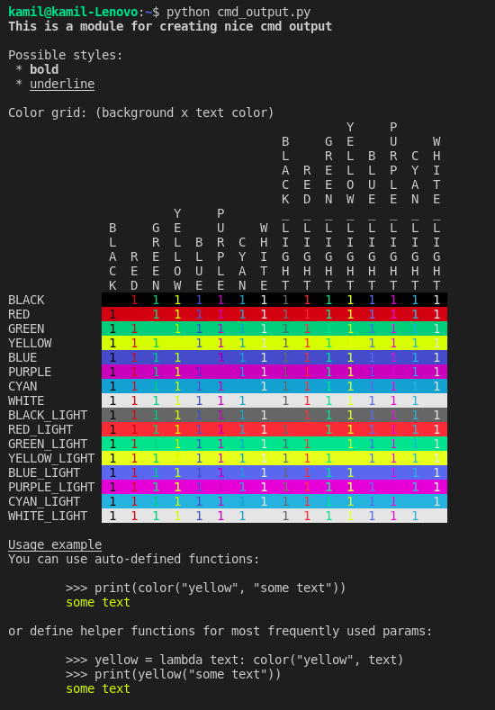

# Helper Module For Text Coloring

### Defined functions:
* `color(color: str, text: str)`    -> set text color
* `bg_color(color: str, text: str)` -> set text background color
* `style(style: str, text: str)`    -> set text style

### Usage
Basic usage
```python
# prints red text
print(color('red', 'some text'))
```
Functions can be stacked on top of each other
```python
# prints underlined, green text on black background
print(
    style('underline',
        bg_color('black', 
            color('green',
                'some text'
            )
        )
    )
)
```
For commonly used cases you can define helper functions
```python
# prints bold blue text
bb = lambda text: style('bold', color('blue', text))
print(bb('some text'))
```

### Available Text Colors:
* `BLACK`
* `RED`
* `GREEN`
* `YELLOW`
* `BLUE`
* `PURPLE`
* `CYAN`
* `WHITE`
* `BLACK`
* `RED`
* `GREEN`
* `YELLOW`
* `BLUE`
* `PURPLE`
* `CYAN`
* `WHITE`

### Available Background Colors:
* `BLACK`
* `RED`
* `GREEN`
* `YELLOW`
* `BLUE`
* `PURPLE`
* `CYAN`
* `WHITE`
* `BLACK`
* `RED`
* `GREEN`
* `YELLOW`
* `BLUE`
* `PURPLE`
* `CYAN`
* `WHITE`

### Available Styles:
* `BOLD`
* `UNDERLINE`

### Command line run output
